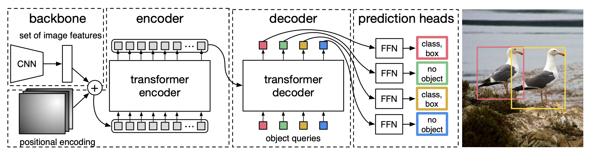
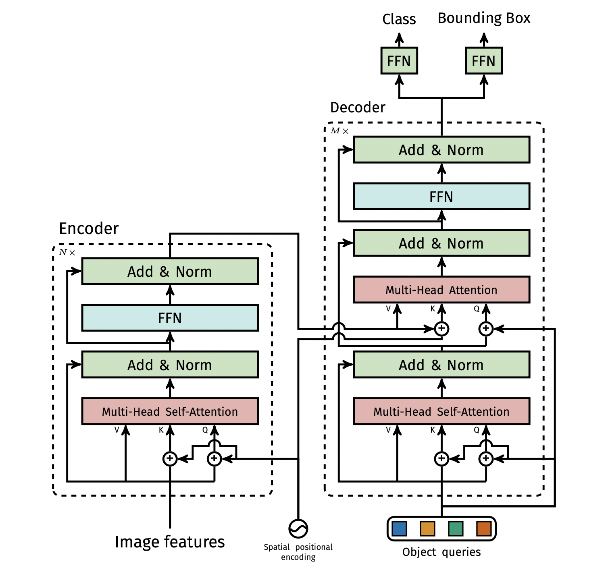

# DEtection TRansformer (DETR)
DEtection TRansformer is a deep learning based object detection solution provided by Facebook. It utilizes Transformers to generated predictions of objects and their position in an image.

To quote the authors from their paper:  
```
We present a new method that views object detection as a direct set prediction problem. Our approach streamlines the detection
pipeline, effectively removing the need for many hand-designed components like a non-maximum suppression procedure or anchor 
generation that explicitly encode our prior knowledge about the task. The main ingredients of the new framework, 
called DEtection TRansformer or DETR, are a set-based global loss that forces unique predictions via bipartite matching, 
and a transformer encoder-decoder architecture. Given a fixed small set of learned object queries, DETR reasons about the 
relations of the objects and the global image context to directly output the final set of predictions in parallel. 
The new model is conceptually simple and does not require a specialized library, unlike many other modern detectors. 
DETR demonstrates accuracy and run-time performance on par with the well-established and highly-optimized Faster RCNN 
baseline on the challenging COCO object detection dataset. Moreover, DETR can be easily generalized to produce panoptic 
segmentation in a unified manner. We show that it significantly outperforms competitive baselines.
```  

## DETR Architecture



DETR uses a conventional CNN backbone to learn a 2D representation of an input image(in our case, a resnet50 till the last convolution layer). The model flattens it and supplements it with a positional encoding before passing it into a transformer encoder. A transformer decoder then takes as input a small fixed number of *learned positional embeddings*, which we call object queries, and additionally attends to the encoder output. We pass each output embedding of the
decoder to a shared feed forward network (FFN) that predicts either a detection (class and bounding box) or a “no object” class.

Typically, We use output generated by the bockbone with channel size as 2048 and height and width as H/32 and W/32, where H and W are the original image height and width.

## Encoder - Decoder




## Object Queries


## Bipartite Loss


## Contributors
Abhiram Gurijala  
Arijit Ganguly  
Rohin Sequeira
